# SuoTu (索图)

> An **application-layer log analysis workbench** for incident response — the name
> comes from the Chinese idiom 按图索骥 ("follow the map to find the steed"):
> the logs *are* the map. Web access logs, middleware logs, business application
> logs — bring them in, hunt, seal the case, leave.

SuoTu is a **local, offline-first, human-in-command** log analysis platform:
import → normalize → four-layer funnel analysis → human verdicts → sealable case.
**It is an analysis platform, not a log platform**: no collector, no agent, no live
ingestion, no long-term retention, no multi-tenant dashboards — deliberately not a SIEM.

## Core principles

1. **Humans hold the verdict** — everything produced by rules or AI lands in a
   candidate review queue; nothing enters the clue store without a human click.
2. **Deterministic core + LLM at the edge** — signature matching, statistical
   aggregation and normalization run first and deterministically; AI only does
   close reading inside seeded windows, and can always be switched off.
3. **Chain of custody never breaks** — originals live in a read-only vault
   (SHA256-anchored); every judgement is anchored to "log source + line number +
   hash"; the audit log is a hash chain.
4. **A case is sealable** — one analysis = one archivable, hand-over-able,
   independently verifiable package.
5. **Events are atoms, not elements** — one line (or one multiline block) = one
   event, raw text preserved in full; only index/aggregation fields are extracted.
   Never split into elements for matching (Cartesian explosion — empirically failed).

## Highlights

### Four-layer funnel (instead of "blind slicing everything")

```
L1 Deterministic full scan (zero AI): signature rules + statistical
   aggregation + IOC matching → suspicious anchors
L2 Anchor seeding: windows cut around anchors (suspicious spans / anomalous
   time windows), boundaries auto-overlap
L3 AI close reading (map-reduce): runs only on seeded windows; a synthesis
   pass threads the cross-chunk story
L4 Candidate review queue: everything stays pending until a human rules;
   "no anomaly" requires a triple-negative attestation
```

The token cost of blind full-volume scanning never happens; the offline_lite
tier (no AI) degrades honestly and stays fully usable.

### Key-value comparison operator family (battle-tested hunt patterns)

Statistical rules are parameterizable comparison operators (YAML data files,
human-reviewable and swappable):

- **Same-key divergence** — same path+IP+UA, significant split in response
  size/status across methods (0-day hunting pattern)
- **Cross-key same-value clustering** — a rare UA reused across many IPs =
  suspected common origin (rarity threshold + crawler exclusion KB +
  probabilistic wording; never asserts "same attacker")
- **Same-key rate spike** — sudden rate/distribution shift over time (z-score)
- **Same-key size outlier** — same path+method+status, response bytes deviating
  from the group median beyond threshold (size anomalies surface semantic events)
- **Cross-source entity correlation** — the same public entity appearing in ≥2
  log sources is linked automatically (private-IP/account entities structurally
  excluded to prevent misattribution)
- **Sequence motif** — same-key A→B chain within a time window (auth-failure
  storm followed by a success = brute-force-success chain; sources without
  ts_utc are honestly skipped)
- **Periodicity beacon** — same-key requests at regular intervals (coefficient
  of variation + sample count + span gates; heartbeats are periodic too, so
  this stays a weak signal for human review)

Rule governance trio: **custom rules** (draft→review→enable lifecycle, built-ins
read-only, schema gate on save), **budget caps** (per-rule per-case hit limit,
overflow truncated and honestly marked), **scan rounds** (every scan is a
numbered round; hits carry round badges and can be filtered by round).

### Format governance (the engineering answer to a thousand log formats)

- Three-stage ingestion: **fingerprint detection suggests (confidence + sample
  preview) → human confirms or hand-picks → descriptor-file fallback**
- Custom formats = YAML descriptor files (regex/json/csv + field_map + multiline
  merge + encoding declaration), with a **draft→review→enable governance chain;
  imported descriptors are always draft and never auto-enabled**
- **AI-assisted drafting**: samples go to AI for a draft descriptor that only
  takes effect after human review (drafts never touch disk)
- 11 factory descriptors (catalina×2 / logback / log4j / Tongda OA×4 / Yii,
  GBK family included)

### True-source recovery (XFF)

When an nginx combined line has a trailing quoted IP list, it is extracted as a
dedicated `xff` field — behind a cloud WAF the first-column IP is the
back-to-origin node, and the real client lives in XFF, directly searchable.
A built-in checker-UA attribution rule fires a reminder: "don't mistake the
middleman for the attacker."

### Supplementary evidence

Incident response constantly adds material mid-flight (EDR logs, firewall
exports, session captures): tick "supplementary evidence" on upload — tagged,
audited, and searchable through the same pipeline (confirm format → parse →
full-text searchable).

### Single retrieval layer

The frontend search box, the rule engine, statistical aggregation and the AI
tools all go through **the same query module** — what AI can see is
structurally identical to what humans can see. No backdoor where analysis
finds things AI cannot.

### Chain-of-custody engineering

Read-only vault + SHA256 verify-before-read + line-number anchors + hash-chained
audit + independently verifiable seal (the verifier is a pure function and works
without the platform).

### Case journal (records area)

Scan rounds, AI runs and human notes merge into one timeline: automatic entries
faithfully transcribe the ledgers, and manual notes can carry anchors that jump
straight back to a hit / round / AI report / original line — the reasoning
process of a case is replayable.

### Native EVTX parsing & correlation-strength ranking

- Upload `.evtx` (Windows Event Log) directly — no pre-conversion
  (dual-channel: normalized fields + raw anchors);
- Cross-source hits carry a PageRank-style linkage score (rarity × frequency,
  fully deterministic), so AI close-reading starts from the strongest anchors
  instead of spreading effort evenly.

### Performance

- Parallel parsing (process pool over line ranges, auto-enabled for line-safe
  formats): 894MB / 4.69M-line nginx log parsed in **45.5s** (318.9s serial on
  the same machine, 7.0×); derived data proven row-identical between parallel
  and serial (assertion-level tests).
- 5.7GB / 48.94M-line mixed business-log stress test: parse 823s, LIKE full-text
  search linear by bytes (5.97s/6.7GB), field-filtered search sub-second.
- Honest boundary: multiline-merge formats (Java stack traces) and headered
  CSV/IIS formats stay serial (cross-line state can't be split);
  `SUOTU_PARALLEL_WORKERS=1` forces full serial.

## Security statement (read me first)

- **This tool is only for authorized security analysis, incident response and
  forensics.** You must hold legal authorization over what you analyze; the
  authors accept no liability for misuse.
- **Data never leaves the machine**: everything (case DB / vault / accounts)
  lives in the runtime directory `data/`; no telemetry, no callbacks, no
  third-party analytics.
- **AI egress is the only data exit, and it has three gates**: ① the first time
  you save an online-provider config you must explicitly tick "case data will be
  sent to a third-party model service" (persisted and auditable); ② any case can
  be individually set to "AI egress forbidden" (a hard gate — online calls for
  that case are rejected); ③ using local Ollama or the offline_lite tier
  (deterministic, fully functional) means zero egress.
- AI keys live only in the project-root `.env` (never in the DB, audit log,
  application logs or response bodies; APIs return masked values only).
- Change the default account password immediately after deployment; password
  hashes use pbkdf2-sha256 with 200k rounds.
- Everything produced by rules, statistics or AI is a **candidate** and does not
  constitute a final attribution of any party. The platform does not endorse
  your conclusions — the human does.

## Deployment

### Option 1: Portable pack (recommended for field work)

Unpack and run — nothing to install (bundled portable Python 3.11, Windows
10/11 64-bit):

```
1. Double-click 启动.bat (keep the black window open; closing it = stop)
2. The browser opens http://localhost:8100 automatically
3. Create the admin account on the web page at first run
```

All data stays inside the pack's `data\` (the USB stick is the evidence
carrier); **close the window before unplugging**.

### Option 2: From source (Windows/Linux)

```bash
# Backend (Python 3.11+)
pip install -r requirements.txt
uvicorn backend.app.main:app --port 8100        # run from repo root

# Frontend dev mode (Node 18+)
cd frontend && npm install && npm run dev        # http://localhost:5173

# Frontend production (served by the backend on the same port)
cd frontend && npm run build                     # dist served by :8100
```

AI configuration (optional): web "AI Settings" → pick a provider and enter a key
(DeepSeek / OpenAI / DashScope / Zhipu / Moonshot / local Ollama / custom
OpenAI-compatible endpoint); saving an online provider requires ticking the
egress consent. Without configuration the platform runs in offline_lite —
rules, statistics and search all fully available.

Host-forensics cross-lookup (optional): configure `TREE_COURT_URL/USER/PASS` in
`.env` to enable one-click reverse lookup of "which hosts saw this IP/account"
on the host-forensics side (read-only; never writes back).

## Usage (full loop)

```
① Create a case (one incident = one case; don't mix incidents)
② Sources tab → upload (txt/log/zip) + fill system name / provenance note
   (tick "supplementary evidence" for mid-flight extra material)
③ Review the fingerprint suggestion (confidence + sample preview)
   → human confirms format & timezone → parse
   · Fingerprints only suggest; a human always approves parse configuration
   · No built-in format for your business log? → write a descriptor in the
     Format Governance tab, or let AI draft one
④ Rules & Scan tab → tick the rules to run (all selected by default) → run scan
   · Every scan is a numbered round; hits carry round badges
   · Custom rules: draft→enable governance, malformed YAML rejected at the gate;
     per-rule budget caps prevent queue floods
⑤ Review tab → rule on each hit: accept as clue / dismiss
   (everything enters the store through here); filterable by round
⑥ Search tab → free text + field filters (IP/UA/method/status/path/XFF,
   exact or contains) + time window; click a line number to jump to the
   original line in the View tab
⑦ AI Analysis tab → seed & close-read (requires pending hits as anchors —
   no seeding without anchors is by design, not a bug) → read the synthesis
   in the report area; findings still land back in the review queue
⑧ Journal tab → scan/AI auto entries + human notes with anchors; replay the
   case's reasoning as one stream
⑨ Wrap up → seal the case (zip in data/exports/, verifiable offline)
```

## Illustrated walkthrough (first-run, step by step)

Screenshots below come from one complete demo case (the synthetic sample ships in the repo root as `demo-access.log`: normal traffic + path traversal + sqlmap scanner UA — upload it to reproduce). The UI is Chinese; the flow maps 1:1 onto the steps above.

**1. First launch → "首次使用?初始化管理员账号" (initialize admin)** — setup is only open while no user exists; passwords must be at least 8 chars.


**2. Fill in admin name + password twice → 初始化管理员 → log in.**

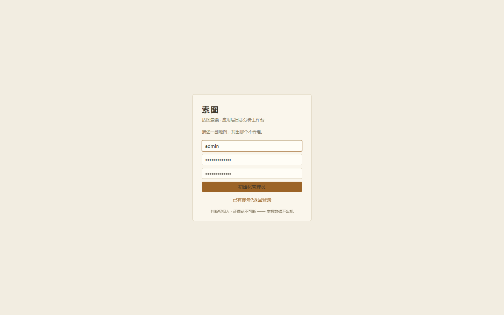

**3. The case list. One incident = one case; never mix incidents.**

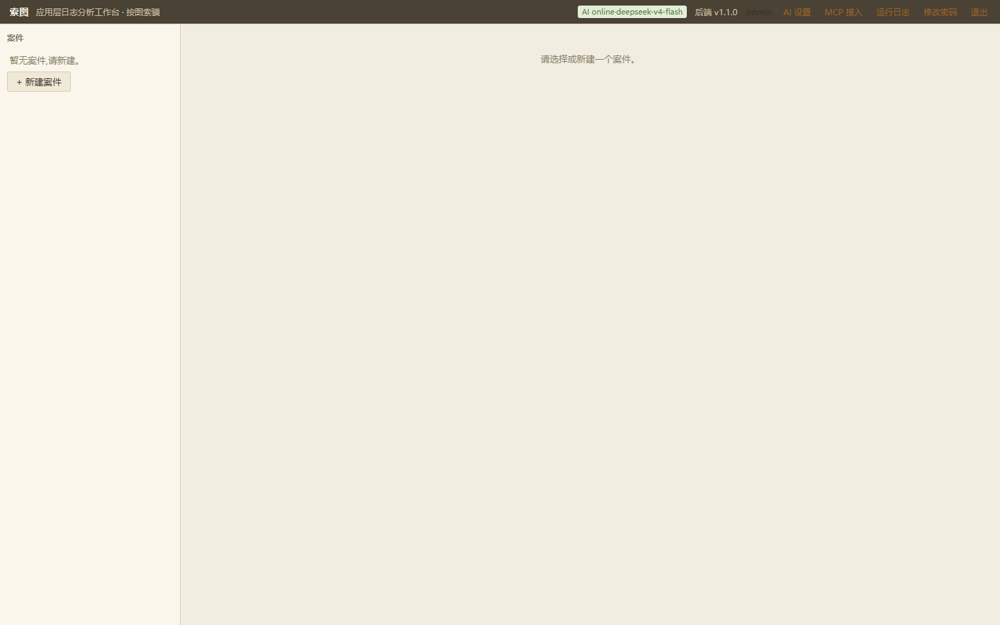

**4. "+ 新建案件" (new case) → name it (incident + date recommended) → 创建.**

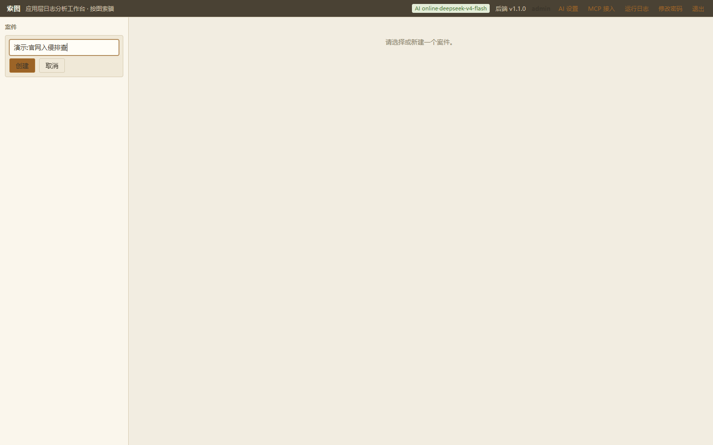

**5. Case home lands on the Sources tab: seal/export on top, upload below.**

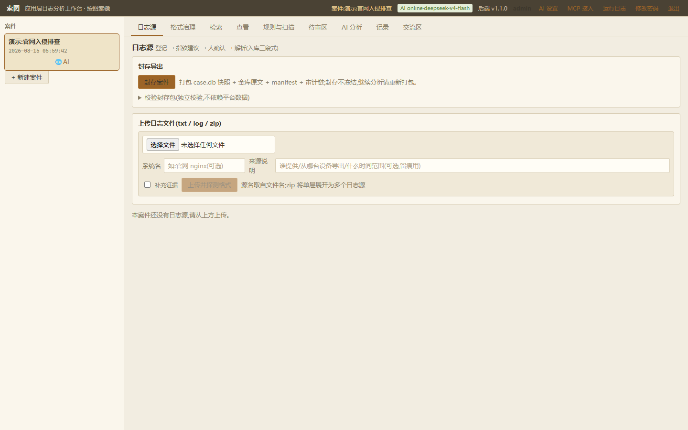

**6. Choose a txt/log/zip file → 上传并探测格式 (upload & fingerprint). The fingerprint is a **suggestion** (format + confidence + sample parse preview); fill the declared timezone (e.g. `Asia/Shanghai`) and click 确认解析配置 — nothing parses without human approval.**

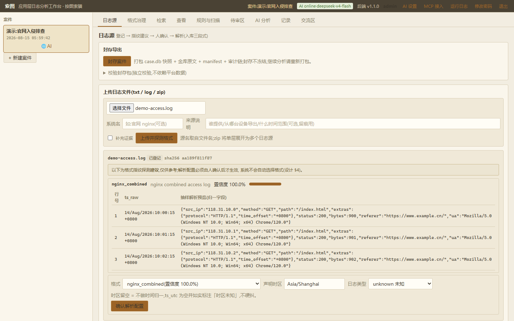

**7. Click 开始解析 (parse) in the source list → status 已解析; the parse report shows per-line success/failure.**

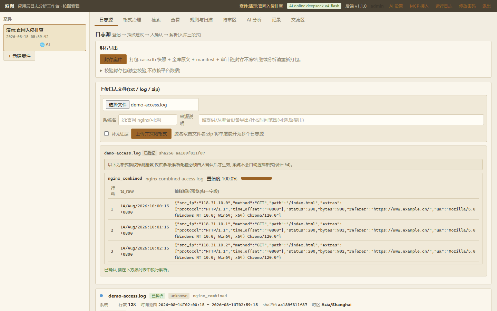

**8. Rules & Scan tab: expand the rule picker to choose what runs (all selected = full sweep; draft custom rules are greyed out) → 运行扫描. All output is **candidate hits** routed to the review queue; every scan is a numbered round ("第 N 轮").**

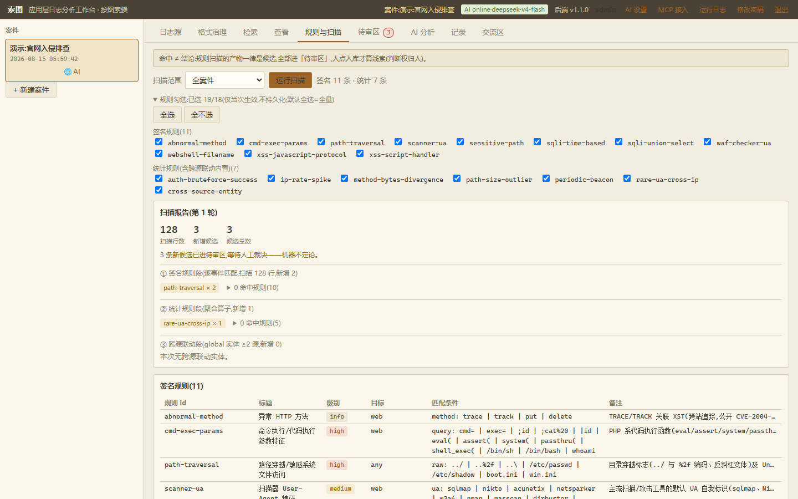

**9. Review tab (待审区): accept as clue / dismiss / cross-check — everything enters the store through human ruling. Hits carry round badges (R1/R2…) and the queue filters by round.**

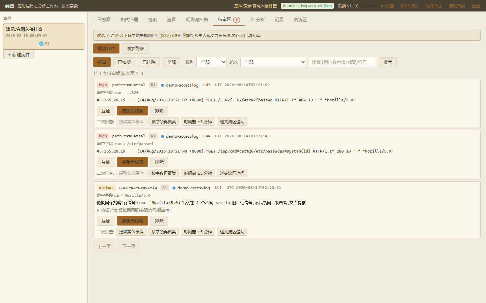

**10. Search tab: free text + field filters (IP/UA/method/status, exact or contains) + time window; line numbers jump to the original.**

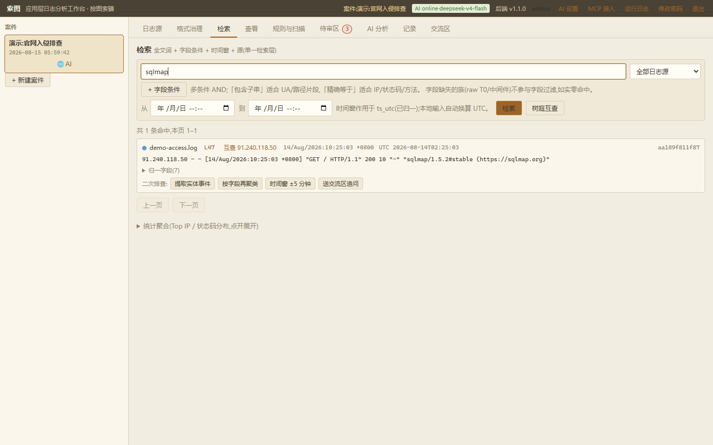

**11. View tab: vault原文 with SHA256 re-check on read and line anchors.**

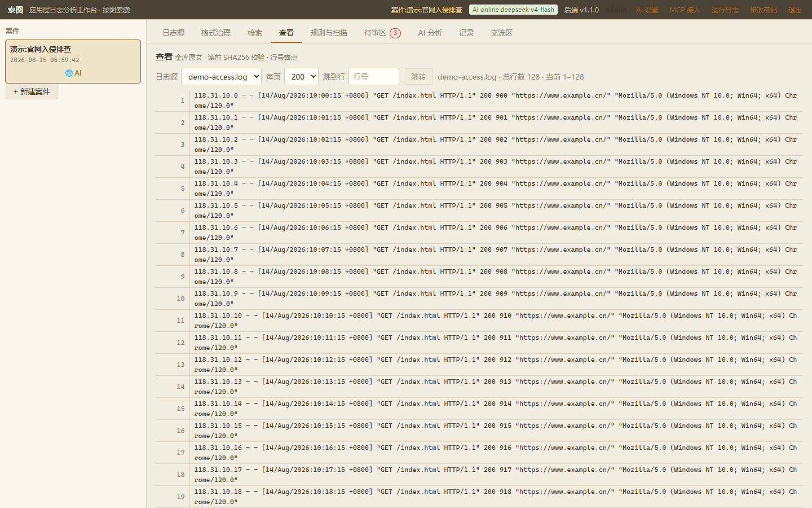

**12. AI Analysis tab: pick a parsed source + token budget → 播种并精读 (seed & close-read, L2+L3). Pending hits are required as anchors — no seeding without anchors is by design. AI findings return to the review queue as pending.**

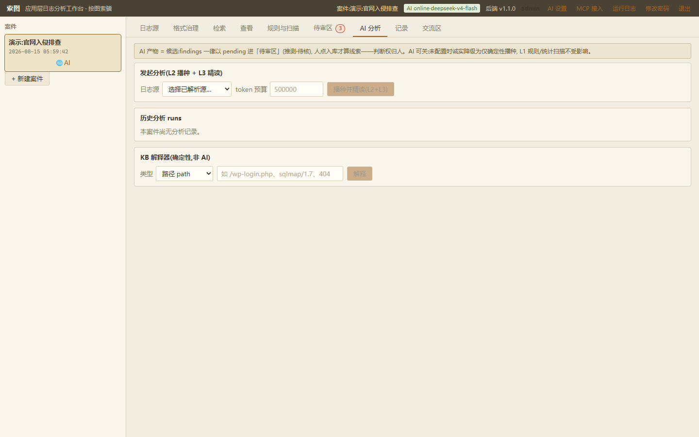

**13. Journal tab (记录): the case log stream — scan rounds and AI runs become entries automatically, and human notes carry anchors that jump back to a hit / round / report / original line.**

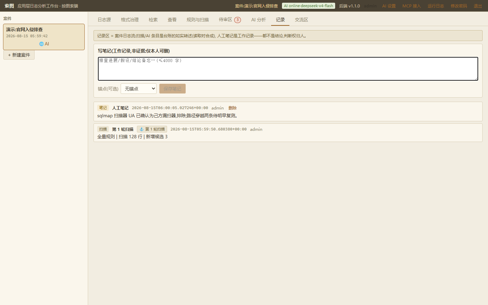

To wrap up, return to the Sources tab → 封存案件 (seal); the zip lands in `data/exports/` and verifies offline.

## MCP integration (drive SuoTu from Cherry Studio / Trae)

Three steps:

1. Top bar "MCP Access" → enable the endpoint → issue a token (**shown in
   plaintext only once — copy it immediately**);
2. Add to your client's MCP config (Trae `mcp.json` example; Cherry Studio:
   pick "Streamable HTTP / HTTP" type):

```json
{
  "mcpServers": {
    "suotu": {
      "url": "http://127.0.0.1:8100/mcp",
      "headers": {
        "Authorization": "Bearer st_mcp_XXXXXXXXXX (paste your token here)"
      }
    }
  }
}
```

   The `command/args` style is for local processes — SuoTu is a remote HTTP
   service, use `url` + `headers`. If the client rejects the type, add
   `"type": "http"` (some versions: `"streamableHttp"`) inside the block.
3. Just ask: "how many cases are in SuoTu", "what activity does IP x.x.x.x
   have in these logs".

Discipline (enforced at the protocol layer): **read-only** — no upload, no
parsing, no verdict changes, no scans; every call is audit-logged; results are
capped and rate-limited; every response carries the reminder that originals are
verified on the web UI and final judgement belongs to the human. The field
portable pack ships without the MCP module (physically excluded — no attack
surface).

## FAQ

- **"Seed & close-read" does nothing?** The source has no pending hits — run
  "Rules & Scan" first. L3 only reads windows selected deterministically; it
  never blind-scans the whole volume.
- **Where do AI conclusions land?** Two places: the report area of the AI
  Analysis tab (process + synthesis), and the Review tab (each finding becomes
  a candidate awaiting verdict).
- **Bad lines in the parse report?** Counted and sampled honestly — never
  dropped, never guessed. Many bad lines usually mean the wrong format or a
  variant — switch format or write a descriptor.
- **Chinese text unsearchable?** For GBK logs beyond the three built-in formats,
  declare `encoding: gbk` in a descriptor.
- **Format not recognized?** Fall back to raw T0 (raw text searchable), then
  write a descriptor.
- **Slow parsing of a huge file?** Auto-parallel only kicks in for single-line
  formats ≥16MB; multiline-merge formats (Java stacks) stay serial by design.
  `SUOTU_PARALLEL_WORKERS=1` forces serial.

## Tests

```bash
python -m pytest          # 267 cases: synthetic-sample contracts / negative
                          # samples / human-verdict assertions / single-plane
                          # contracts / parallel-serial equivalence
```

Discipline: parsers are written against specs, not values; AI output never
enters the store automatically (assertion-level); single-retrieval-layer
contract tests (whatever the funnel gets, the AI tools must get);
parallel/serial derived data is row-identical (assertion-level).

## Repository layout

```
backend/
  app/           FastAPI backend (ingest/vault/retrieval/rules/operators/AI/
                 governance/seal/auth/parallelism)
  app/formats/   built-in format parsers + descriptor engine
  rules/         signature rules (builtin/) + statistical operators (stats/) —
                 YAML data files
  kb/            knowledge base (crawler-UA exclusion list / web explainer)
  formats/desc/  format descriptors (always draft from factory; human-enabled)
frontend/        React frontend (vite)
tests/           pytest (synthetic-sample discipline)
```

## License

[Apache License 2.0](./LICENSE). If you build on SuoTu, keep the copyright
notice and mark your changes prominently.

Sample credits: ocatak/apache-http-logs (academic dataset),
wallarm/gotestwaf payloads (MIT), logpai/loghub (research attribution).
